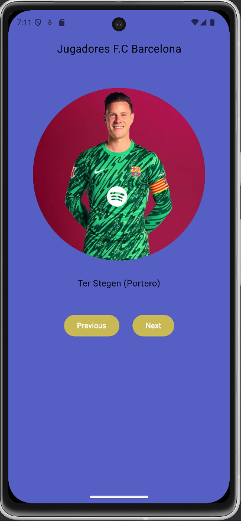
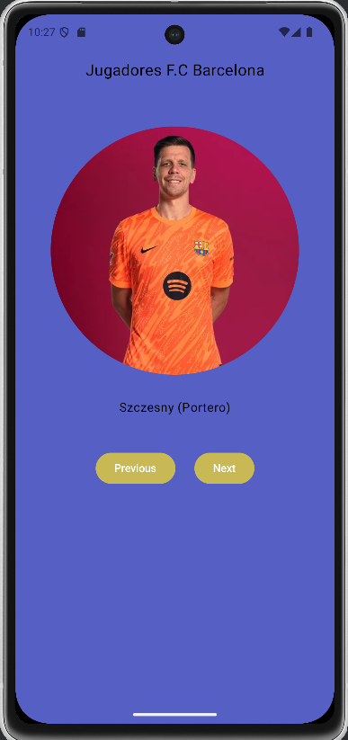
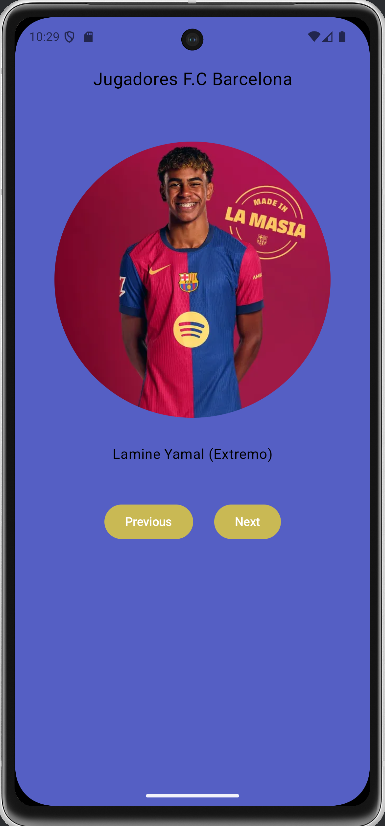
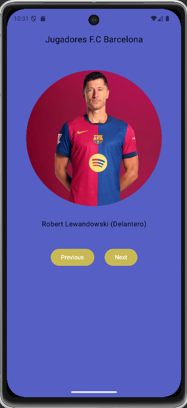

# Android App
- [Language and tools](#languages-and-tools)
- [Next button functionality](#next-button-functionality)
- [Previous button functionality](#previous-button-functionality)
- [App appereance](#first-look-of-the-app)
- [Tests](#tests)


This is a basic app I've made for learning about Android Studio with Jetpack Compose.
It's mission is showing the players of a football team (F.C Barcelona). I've upload 14 players with their names 
and positions.

I've worked with buttons, two in this case, one with the functionality of going to the previous image and the other button for going to the next image.
## Languages and Tools

   
 

  
  **Training Course**: <a href="https://developer.android.com/courses/android-basics-compose/course" target="_blank">https://developer.android.com/courses/android-basics-compose/course</a>
  Get the app [Here](#get-the-code)

  ## Next button functionality
  ```Kotlin
internal fun nextImage(result : Int) : Int {
    var resultImage: Int = result
    if (resultImage == 14) {
        resultImage = 1
    }else {
        resultImage++
    }
    return resultImage
}
````
 ## Previous button functionality
```Kotlin
internal fun previousImage(result : Int) : Int {
    var resultImage: Int = result
    if (resultImage == 1) {
        resultImage = 14
    }else {
        resultImage--
    }
    return resultImage
}
```
This two functions have been used on the [Tests](#tests) directories. They have @VisibleForTesting annotation.
```Kotlin
@VisibleForTesting
internal fun previousImage(result : Int) : Int {
    var resultImage: Int = result
    if (resultImage == 1) {
        resultImage = 14
    }else {
        resultImage--
    }
    return resultImage
}
```
## First look of the app
<a></a>
<a></a>
<a></a>
<a></a>

<p>The first image is Ter Stegen, the goalkeeper, and the last one Lewandowski (Striker). So, if we press previous at the start, the app show us Lewandowski, and if we go on with next button, Ter Stegen appears.</p>

## Tests
This app has two differents kind of tests, Local and Instrumentation tests.
### Local test
```Kotlin
package com.example.artgallery

import junit.framework.TestCase.assertEquals
import org.junit.Test

class ArtGalleryTests {
    //Test the borderline cases
    @Test
    fun caculateNextImage() {
        var result = 14
        result = nextImage(result)
        assertEquals(1,result)
    }

    @Test
    fun calculatePreviousImage() {
        var result = 1
        result = previousImage(result)
        assertEquals(14,result)
    }
    @Test
    fun calculateTwoPreviousOneNextImage() {
        var result = 1
        result = previousImage(result)
        result = previousImage(result)
        result = nextImage(result)
        assertEquals(14,result)
    }
}
```
### Instrumentation test
```Kotlin
package com.example.artgallery

import androidx.compose.ui.test.junit4.createComposeRule
import androidx.compose.ui.test.onNodeWithText
import androidx.compose.ui.test.performClick
import androidx.test.platform.app.InstrumentationRegistry
import com.example.artgallery.ui.theme.ArtGalleryTheme
import org.junit.Rule
import org.junit.Test

class ArtGalleryUITests {
    @get:Rule
    val composeTestRule = createComposeRule()

    @Test
    fun previousImage() {
        composeTestRule.setContent {
            ArtGalleryTheme {
                PlayerPanel()
            }
        }
        // Obtener el contexto de la prueba
        val context = InstrumentationRegistry.getInstrumentation().targetContext
        val expectedText = context.getString(R.string.lewandowski) // Obtener el texto real
        composeTestRule.onNodeWithText("Previous").performClick()
        composeTestRule.onNodeWithText(expectedText).assertExists() // Buscar por el string real
    }

    @Test
    fun nextImage() {
        composeTestRule.setContent {
            ArtGalleryTheme {
                PlayerPanel()
            }
        }

        val context = InstrumentationRegistry.getInstrumentation().targetContext
        val expectedText = context.getString(R.string.szczesny) // Obtener el texto real
        composeTestRule.onNodeWithText("Next").performClick()
        composeTestRule.onNodeWithText(expectedText).assertExists() // Buscar por el string real
    }

    @Test
    fun previousAndThreeTimeNext() {
        composeTestRule.setContent {
            ArtGalleryTheme {
                PlayerPanel()
            }
        }

        // Simular 3 clics en "Next"
        repeat(3) {
            composeTestRule.onNodeWithText("Next").assertExists().performClick()
        }

        // Simular 1 clic en "Previous"
        composeTestRule.onNodeWithText("Previous").assertExists().performClick()
        // Verificar que la imagen esperada aparece en la UI
        composeTestRule.onNodeWithText("Araujo (Central)").assertExists()
    }
}
```
## Get the code
```bash
git clone https://github.com/Pablofh97/ArtGallery.git
```
